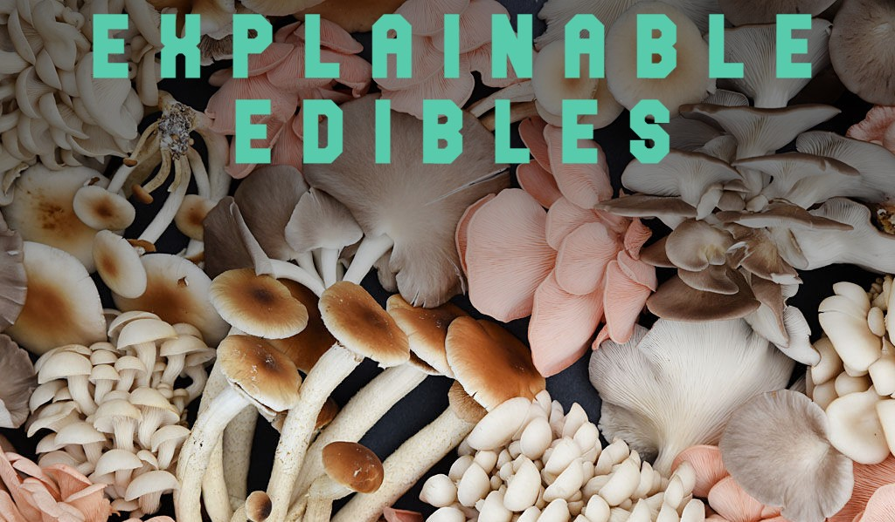
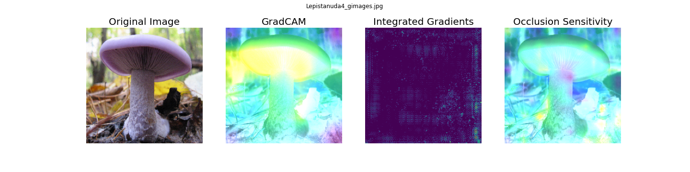
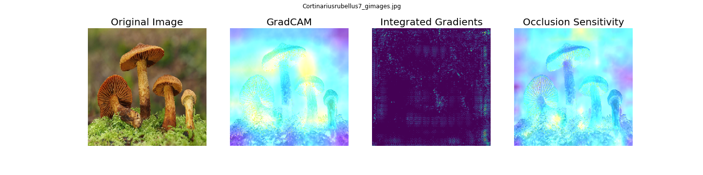

[](https://github.com/psf/black)

<!-- HEADER -->


<p align="center">
  <h1 align="center">Explainable Edibles:</h1>
  <h3 align="center">XAI for Computer Vision</h3>
  <p align="center">
     Capstone project for Northwestern University MSDS 498
</p>


## Table of Contents
* [Overview](#overview)
* [Data](#data)
* [Transfer Learning](#transfer-learning)
* [Explainable AI Methods](#xai-methods)
* [Usage](#usage)


---
## Overview
This project is an investigation of several XAI techniques applied to the toy problem of a CV classification system designed to identify poisonous or edible mushrooms.

By comparing the extracted visual explanatory features to a text-based mushroom identification dataset from Kaggle, we were able to ground-truth the CV model's decision-making.


#### Tools Used
* [BeautifulSoup](https://www.crummy.com/software/BeautifulSoup/bs4/doc/) and [Selenium](https://www.selenium.dev/) were used to scrape the dataset. In all, we ended up with ~10,000 pictures of 81 species of mushrooms.
* [SciKit-Learn](https://scikit-learn.org/) was used to analyze the Kaggle mushroom dataset.
* [Keras](https://keras.io/) and [Tensorflow](https://www.tensorflow.org/) were used to build and train our CNN computer vision model.
* [TF-Explain](https://github.com/sicara/tf-explain) was the XAI library we used to extract feature mappings from our CV model.
---
## Data

#### Image Data
In [notebook #1](./1_Image_scraper.ipynb), we start by using the BeautifulSoup HTML parsing library to scrape photos and data about 142 mushroom species from Mushroom.world. This yielded 659 images, which was far too few. We then built a more robust image scraper using Selenium, which scraped Google Images for (unlicensed) photos of each of the 142 species.

In all, we ended up with ~10,000 photos of 81 different mushroom species, each binned as either edible or poisonous.

*An edible mushroom, Lepista nuda.*


#### Kaggle Dataset
To ground truth our image features, we have a dataset from the [UCI Machine Learning Repo](https://archive.ics.uci.edu/ml/datasets/mushroom). It contains 23 features that describe various properties of 23 different mushroom species, which come from the Agaricus and Lepiota Family. Several variables are available in this dataset including size, shape, color, and more of the gills, cap, stem, etc. They also include visual (i.e., cap color, gill attachment) and non-visual (i.e., odor) attributes of mushrooms.

In [notebook #2B](./2B_Kaggle_dataset_classification), we use logistic regression and recursive feature elimination to identify the most important features in predicting whether a mushroom is poisonous.

---
## Transfer Learning
We needed a neural net model, which we built in [notebook #3](./3_CV_model_training.ipynb).
We used MobileNetV2 as a base model to perform transfer learning. At first, we only unfroze the top convolution block (out of 16) and trained for 30 epochs. After this, we unfroze and fine-tuned the entire model for several more epochs until we reached ~90% accuracy and ~0.97 AUROC.

---
## XAI Methods
In [notebook #4](./4_XAI_technique_exploration.ipynb), we instantiate and compare three XAI techniques for our computer vision model:
* [GradCAM](https://github.com/sicara/tf-explain#grad-cam): Visualizes how parts of the image affects neural network's output by taking a gradient-weighted average of the class activation maps.
* [Integrated Gradients](https://github.com/sicara/tf-explain#integrated-gradients): Visualizes an average of the gradients along the construction of the input towards the decision.
* [Occlusion Sensitivity](https://github.com/sicara/tf-explain#occlusion-sensitivity): Visualizes how parts of the image affects neural network's confidence by occluding parts iteratively.




---
## Usage
To run any of the included Jupyter notebooks locally, you will need:
* Python 3.7+
* Pipenv
* An active internet connection and web browser

To install all the dependencies, run the commands:
```sh
$ pipenv install
```

Then launch Jupyterlab within the virtual env by running the command:
```sh
$ pipenv run jupyter-lab
```
Then simply follow along with the notebook instructions.

---
Read our [final report here](./assets/Final_report.pdf).
